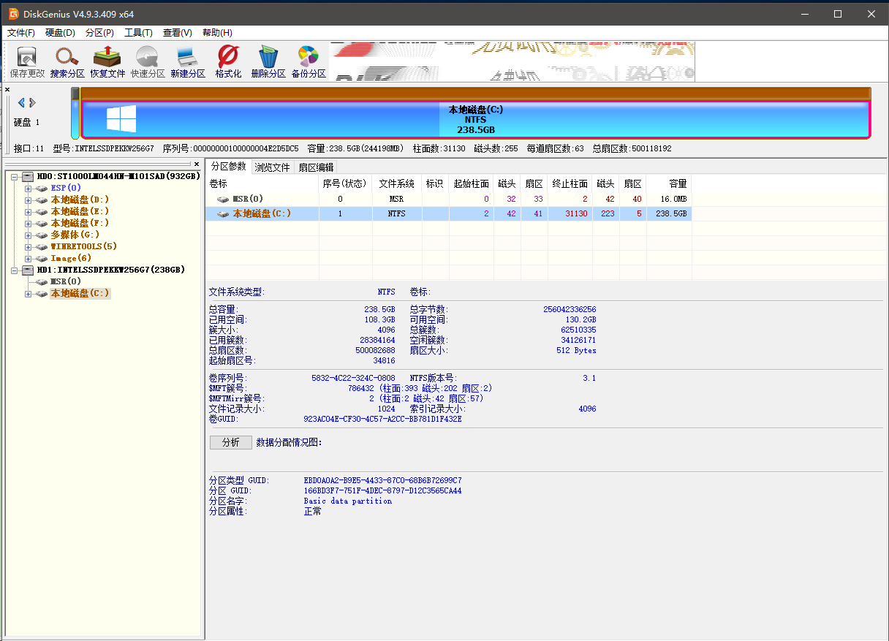

## Windows常用维护指南(Guide for Windows)

### Legacy引导转换为UEFI(Convert Legacy Boot Mode to UEFI)

##### 在开始操作之前，请阅读以下注意事项并做好相应准备:  
* 备份硬盘中的数据，尤其是系统分区中的数据。
* 关于重新安装Windows系统，请参考以下条目: [重新安装Windows操作系统](windows-reinstall.md)
* 你需要知道[UEFI](https://en.wikipedia.org/wiki/Unified_Extensible_Firmware_Interface)和Legacy引导分别是什么。
* Windows 7对于UEFI引导的支持极其有限，Windwos 7以前的Windows操作系统不支持UEFI引导。

##### Before we start, you must pay attention to this thing and get ready:  
* Back up your data, especially data in system volumn.
* Reinstall windows. You can refer to this section: [Reinstall Windows](windows-reinstall.md)
* You have to know what is [UEFI](https://en.wikipedia.org/wiki/Unified_Extensible_Firmware_Interface) and legacy boot mode.
* Windows 7 has a very limited support for UEFI mode and Windows released before Windows 7 do not support UEFI mode at all.

##### 操作步骤
1. 进入BIOS并启用UEFI引导模式。如果你发现你的电脑不支持UEFI引导，我推荐你拿个锤子来。你也可以将Legacy引导禁用。
2. 加载PE系统并运行[DiskGenius](http://www.diskgenius.cn/)程序。  
  
3. 选择需要进行转换的磁盘驱动器，右击选择“转换分区表类型为GUID”。保存更改然后退出DiskGenius。
4. 重新安装Windows操作系统。当安装程序要求你进行分区时，删除原先的系统分区和与之相关的小隐藏分区，并在空出的区域新建一个分区，并允许Windows安装程序自动建立必要的必要的ESP和MSR分区。
5. 以下步骤即可参见重新安装Windows系统的条目。

##### Steps
1. Enter into BIOS and activate the UEFI boot mode. If you find your PC is not supported, I suppose you should get a new one. You can also ban the legacy boot mode.
2. Using Windows PE and find this tool called [DiskGenius](http://www.diskgenius.cn/).  
  
3. Select the driver, right click it and then click "Convert Partition Table Type into UEFI". Then save your changes in DiskGenius and quit. 
4. Reinstall system. When asked to select partition to install, you must delete the old system partitions(and some small partition attached to it) and generate a new one by click the space area and click new. Windows Setup Program will do this automatically.  
5. The next step is same as reinstalling windows.
