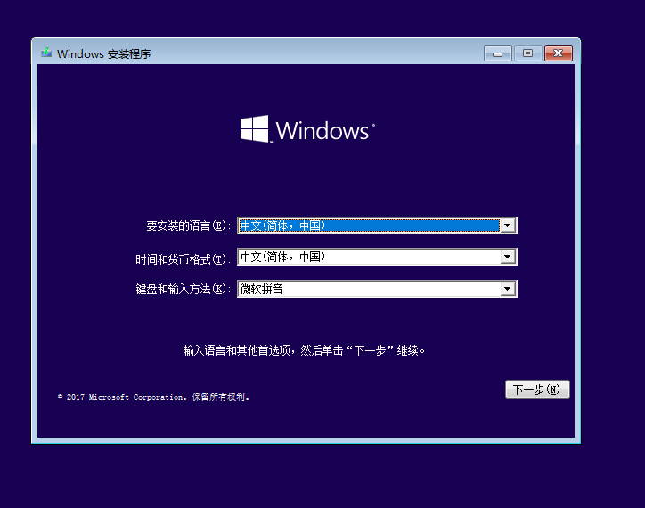
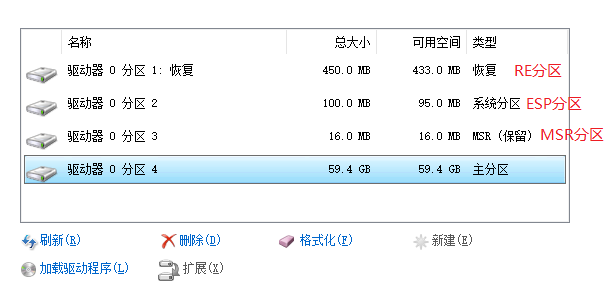
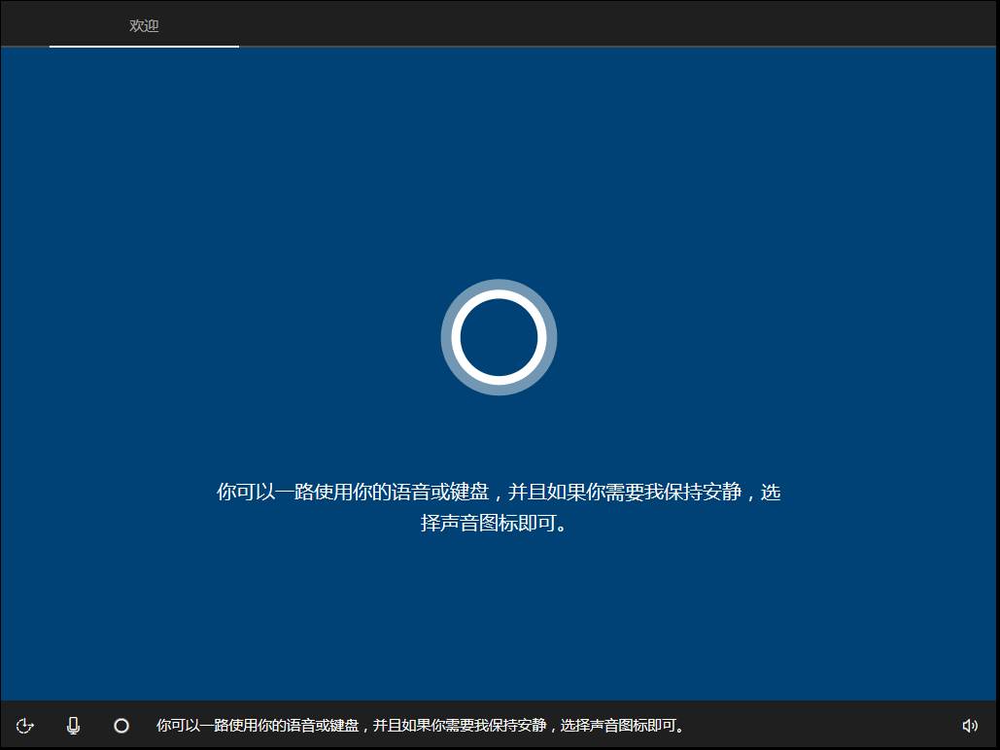

## Windows常用维护指南(Guide for Windows)

### 安装系统(Install Windows)
1. 下载系统映像(Download Windows Image)  
    [itellyou](https://msdn.itellyou.cn/)  
    [豆豆分享](https://www.iruanmi.com/msdn/)  
    [MVLS·Fudan University](http://mvls.fudan.edu.cn) (Only internal network available)  
    *you must download the volume license version, otherwise you need a serial number to activate windows in following step.*
2. 制作启动U盘(Make a bootable Windows install device)  
  For windows,you can use UltraISO to write image into your disk.  
  For Linux-based system, you can use dd to do the same thing.
    ```shell
        # umount the device before format.
        $ sudo umount -t fat32 /dev/<your_usb_device>
        # then format the device and turn filesystem info fat32
        $ sudo mkfs -t fat32 /dev/<your_usb_device>
        # use dd to write in.
        $ sudo dd if=<image_you_download> of=/dev/<your_usb_device>
    ```
3. 从U盘启动(Boot from USB driver)  
    First you have to enter BIOS to change the boot sequence to make sure your PC is booting from USB driver.  
    The key you need to press before booting varies depending on your PC manufacturer.  
    Another way is to use fast boot menu to decide a once boot device.
    <table>
        <tr>
        <th>Manufacturer</th>
        <th>Key</th>
        <th>Fast Boot Menu Key</th>
        </tr>
        <tr><th>Dell</th><th>F2</th><th>F12</th></tr>
        <tr><th>ASUS</th><th>Esc</th><th>F10</th></tr>
        <tr><th>Surface</th><th>Volume Key</th><th>
        <tr><th>Apple</th><th></th><th>option</th></tr>
        <tr><th>ThinkPad</th><th>Enter</th><th>F12</th></tr>
        <tr><th>Lenovo</th><th>F2</th><th>F12</th></tr>
    </table>
    For some devices like lenovo, you need to disable the fast startup so that you can enter BIOS or fast boot menu. You can <b>restart</b> your computer in order to boot your device without fast start up. 
4. 安装Windows(install Windows)  
    *Warning: Before installing Windows, you must backup your data in system volumn like files in desktop or documents. If you cannot enter your system, you can use PE(Preinstall Environment) to do the same thing.*  
    we will take Windows 10 as example.  
    a. You may see this as long as you enter the installation.Just Next.  
      
    b. You may see some choices just like "Install Windows" or "repair this computer", and if you want to do something to fix instead of reinstalling you can give a shoot at garbage repair tools. Here we choose "Install Windows"  
    c. For choosing version, you must choose a volume license version if you don't want to [buy a serial number from X bao](http://www.taobao.com), unless this computer was bought with a Windows 10 system. you can open a terminal by `shift` + `F10` and type this command to find the old system version.  
    <br>
    ```shell
        > dism /Image:<your old system path> /Get-CurrentEdition
    ```
    If you are sick with terminal, you can use [Dism++](http://http://www.chuyu.me/zh-Hans/index.html). Run it in PE and you will get the same result. If the owner makes sure that this system is genuine, you can install a same version and it will activate itself.  
    d. Accept the license and choose Install Windows when asked install type. DO NOT CHOOSE UPDATE OTHERWISE YOU CAN GET NOTHING.  
    e. This is a very important step. You must choose a disk for windows to install in.
      
    If you are using a [UEFI](https://en.wikipedia.org/wiki/Unified_Extensible_Firmware_Interface) boot mode, you   can just find the disk old windows was installed and format it. You can at the same time delete this volumn and create a new one. One thing not recommended is that you can delete RE, ESP and MSR volumn at the same time if you want to install cleanlier.  
    If you are using Legacy BIOS mode you can do the same thing. But we recommend you to turn to UEFI as long as you can. If you are using Windows & at the same time, to keep is also a good idea. If you want to turn into UEFI, you may reference this section:[Switch between UEFI and Legacy](legacy_uefi.md).  
    After right operation, just next and the install starts.Please wait.(If you don't mind I suggest you should talk with the owner especially when owner is a girl?)  
    f. When you see this circle, you should be prepared to help the owner to  set user information.And let this guy mute may be a good choice.  
      
    Just follow the wizard.  
    g. Install drivers. You may download the [Driver Genius(司机精灵)](http://www.drivergenius.com/) to help you to do the same thing. And JUST BE CAREFUL WHEN INSTALLING THIS GARBAGE.  
      
    Once you finish using it, don't be hesitate and just let it bye.  
    And now you have installed a new Windows 10. For Windows 7 this is similar and 

    


    