红温的除了 C 盘，还有屏幕面前的你 :rage:

<!-- more -->

## 写在前面

本文提到的大部分工具和其它一些常用工具可以在 [**图吧工具箱**](https://www.tbtool.cn/)（点击链接进入官网）里找到，大家 !!嫌麻烦的小朋友!! 可以下载使用 :P。

!!我们真的不是打广告!! :confounded:

## 使用 SpaceSniffer 工具检查占用大量空间的文件和文件夹

[**SpaceSniffer**](https://sourceforge.net/projects/spacesniffer/) 是一款能够直观显示某个分区的文件占用情况的软件。

下载并解压完成后选中 `SpaceSniffer.exe`，建议右键选择 `以管理员身份运行`，这样软件可以扫描到更多的文件。

打开后，在弹出的对话框中选择要扫描的分区盘符，点击右下角 `Start` 开始扫描：


接下来会有一个十分炫酷 ~~bushi~~ 的界面出现，耐心等待一段时间，直至不再出现新的矩形，右上角有 `Ready` 字样就可以看看时局图啦！

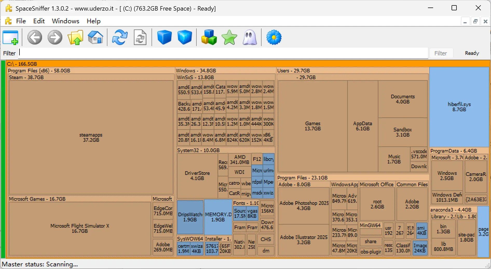

如上图所示，文件（夹）占用的空间越大，其在软件中显示的矩形面积越大。!!一目了然，不言而喻!!

想要了解某个文件夹的子文件夹的空间占用情况，可以单击对应的矩形；双击可以放大查看，再次双击可以缩小回去。

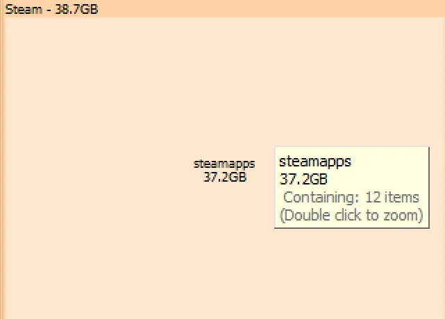


## 常见可以安全开刀的文件和文件夹

使用 SpaceSniffer 扫描后，你可能发现有几个特定的文件和文件夹占用了较大的空间，下面我们介绍其中几个可以删除或部分删除的文件和文件夹。

### `hiberfil.sys`

这个文件是电脑休眠时储存内存中内容的，一般较大，想干掉他我们需要关闭休眠功能。

按 `Windows 键` 或单击任务栏最左（上）边的 `Windows 图标` 打开开始菜单，直接敲键盘输入 `powershell`，搜索结果中应该会有 `Windows Powershell`，选择 `以管理员身份运行`，系统会弹出一个黑色的对话框，键入一下命令：

```powershell
powercfg -h off
```

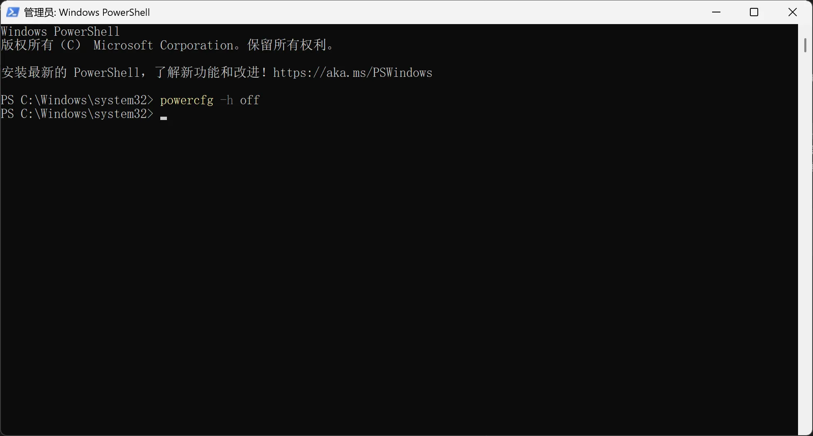

此举关闭了系统休眠功能，现在你可以转到 SpaceSniffer 的对话框，`hiberfil.sys` 会立即消失。

如果后悔了想开回来，可以使用下列命令开启休眠：

```powershell
powercfg -h on
```

### `pagefile.sys`

这个是系统的虚拟内存文件，如果不常用大型软件可以清理；如果需要保留，也可以通过修改设置移动到其它分区（比如 D 盘）。

要调整虚拟内存，请从开始菜单打开设置，进入**系统-系统信息-高级系统设置**（下图中红框的内容）


在高级系统设置中，进入**性能-设置**（下图中红框的内容）

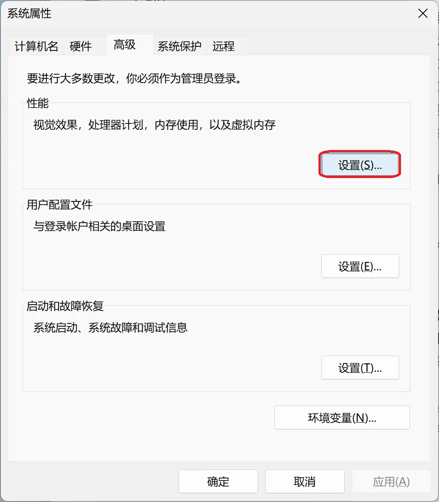

在性能选项中，进入**高级-虚拟内存-更改**（下图中红框的内容）

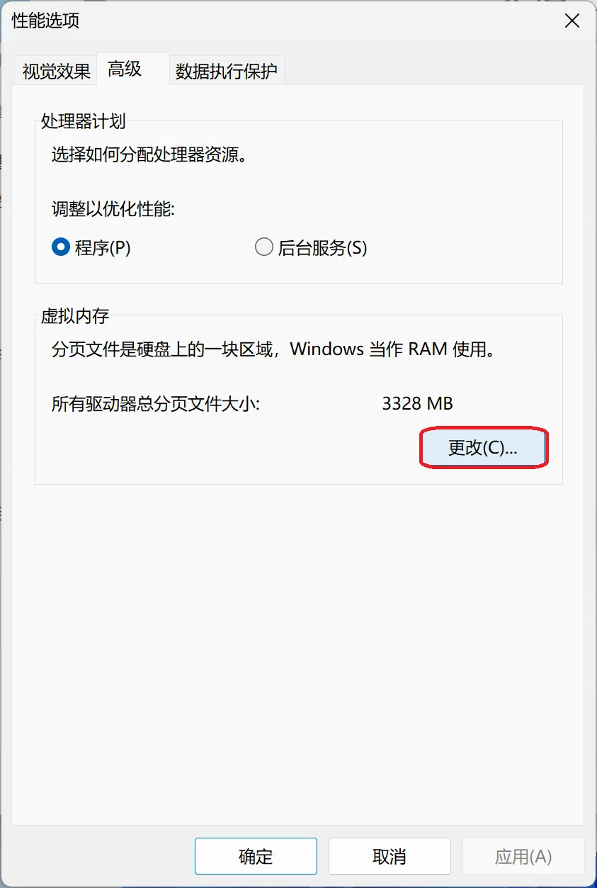

取消勾选 `自动管理所有驱动器的分页文件大小`，我们可以自行管理每个分区的分页文件大小，左边可以选择：

1. 自定义大小（可以设置最大大小）
2. 系统管理的大小
3. 无分页文件（直接删除 `pagefile.sys`）

设置完单击右侧 `设置`，然后可以退出相关设置。


::: important
**重启**之后，相关更改才会生效。
:::

如果要把分页文件放在另一个分区，以 D 盘为例，我们可以在上面的设置中将 C 盘设置为 `无分页文件`，**单击 `设置` 后**，选中 D 盘设置为 `自定义大小` 或 `系统管理的大小`，并单击 `设置` 保存更改。

### 回收站和各类临时文件、缓存等

在 Windows 中删除文件后，文件一般会被移动到**回收站**中，仍然占用了空间，要清理回收站以及一些常见的临时文件、缓存等，可以使用系统自带的**磁盘清理**工具和第三方工具 **Dism++** 清理。

::: tip
一般来说，临时文件、缓存等会在程序运行时再次生成。
:::

#### 使用磁盘清理

打开开始菜单搜索 `磁盘清理`，单击打开：

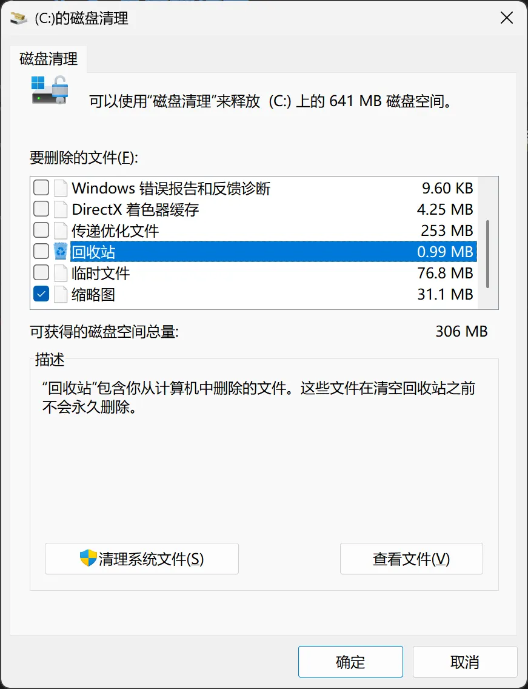

上方 `要删除的文件` 中，可以在左边勾选，选中每一个项目时会有一个描述解释这类文件的功能，选好后单击左下角 `清理系统文件` 即可删除它们。

#### 使用 Dism++

[**Dism++**](https://github.com/Chuyu-Team/Dism-Multi-language/releases/latest) 是一款多功能的系统工具，得名于 Windows 系统工具 **dism**。我们这边使用 **Dism++** 的空间回收功能。

下载并解压完成后双击 `Dism++64.exe`，接受用户协议后进入软件，单击 `空间回收`，同样可以打勾选择要删除的文件，打勾时软件会弹出对话框提示删除该文件的后果，一般保持默认就好。

选好后**先单击右下角左边 `扫描`，再单击右边 `清理`**，即可完成空间回收。

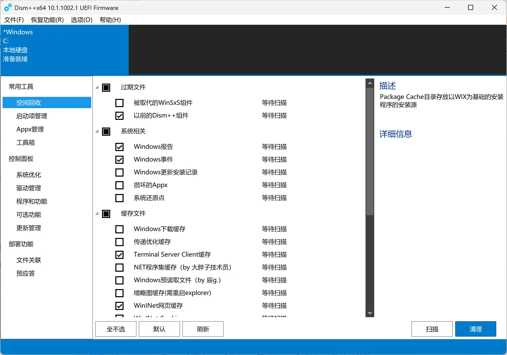

#### 调整回收站

和虚拟内存分页文件类似，回收站的大小也可以调整。

右键单击回收站打开右键菜单，单击 `属性` 会打开下图所示对话框：

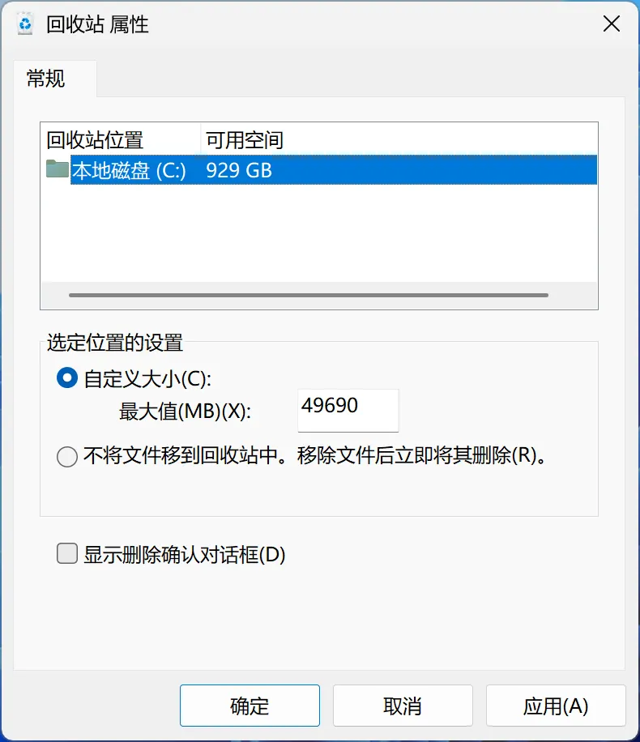

选中回收站所在分区，可以 `自定义大小` 或 `不将文件移到回收站中` 直接关闭回收站。

::: warning
关闭回收站可以释放回收站的空间，但是接下来删除的文件将难以恢复。
:::

## 需要自己综合判断的文件和文件夹

下列的文件和文件夹一般占用了较大空间，但其中的内容很多是有用的，删除时需要慎重，如果拿不准可以到值班室参考队员意见。

### AppData

这是一个隐藏文件夹，要在资源管理器里显示它，我们需要调整文件夹选项。

::: tabs#os

@tab Windows 10#win10

单击资源管理器上方工具栏中的 `查看`，勾选 `隐藏的项目`。


@tab Windows 11#win11

单击资源管理器上方工具栏中的 `查看`，在下拉菜单中单击 `显示`，单击 `隐藏的项目`。


:::

设置好后可以看到 `C:\用户\<用户名>\AppData` 文件夹；如果之前备份过用户文件夹，在备份的位置一般也能看到 AppData。

AppData 一般用于存储各类软件针对当前用户的配置文件等；部分程序安装时选择 `仅当前用户` 也会默认安装到 AppData 中。

一般来说，当前的 AppData 是动不了的，但是实践中我们发现很多客户备份了整个用户文件夹，**上一台机器 / 旧系统**里的 AppData 通常已经不需要了，此时可以大胆删除 **之前备份的用户文件夹中的 AppData**。

### 桌面

大家很多时候会在桌面堆积大量的文件，一方面我们可以仔细检查并清理，另外一方面我们可以给桌面移动位置。

打开资源管理器，一般左侧可以看到 `桌面`，右键单击打开右键菜单。

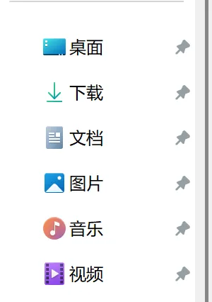

单击 `属性`，打开 `桌面属性`，单击 `移动` 可以选择一个目标文件夹，最后单击 `确定`，在弹出的对话框中选择 `是`，可以将桌面文件夹移动到其它位置（比如 D 盘）。

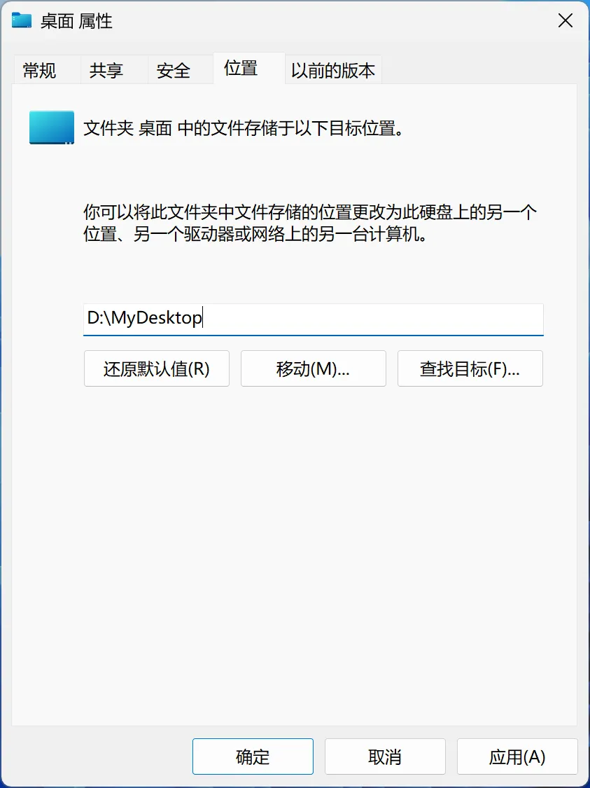

### 已经解压缩的压缩包

我们解压压缩包后，很多时候会忘记删除原来的压缩包，部分压缩包占用空间较大，特别是一些课程提供的虚拟机。

如果找不到压缩包在哪里，可以使用 [**Everything**](https://www.voidtools.com/zh-cn/) 工具搜索。

安装完成后打开 Everything，软件会自动扫描 C 盘，扫描完成后单击 `搜索-压缩文件`，就可以看到所有压缩文件了 :D。


### 重复的文件

很多时候我们不知不觉在电脑中留下了一些重复的文件，大家可以使用各类重复文件搜索工具，这里我们以 [**Czkawka**](https://github.com/qarmin/czkawka/releases/latest)为例（一般选 `windows_czkawka_gui_46.zip`）。

下载后解压，双击 `czkawka_gui.exe` 打开 Czkawka。

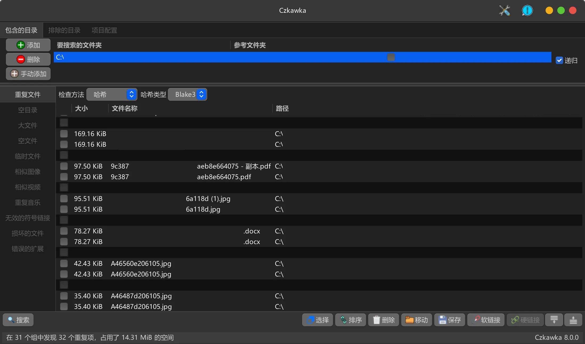

单击左上角 `添加` 添加要搜索的文件夹，单击左下角 `搜索`，等待一段时间，软件会列出完全相同的文件，我们可以决定哪些要删除，勾选后单击右下方 `删除`。

另外，往往我们收来的课程资料都是几经周转，里面很可能有重复文件，还请大家留心（笑）。

### QQ / 微信文件

腾讯 QQ 和微信一般会自动下载图片和其它文件，我们可以单击左下角菜单图标（三条横线）进入设置，单击 `文件管理`，可以单击 `更改（目录）` 设置接受到的文件存储的目录（比如改成 D 盘的一个位置），也可以单击 `打开文件夹` 进入相应文件夹清理。

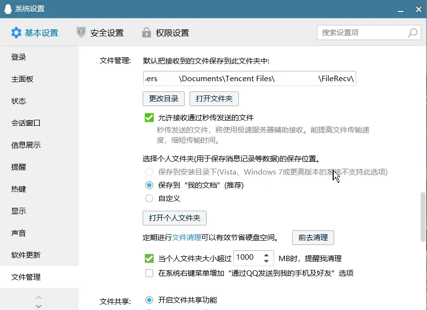


### 已安装的程序

这个算是下策，如果实在挤不出空间，可以在设置中进入 **应用-安装的应用 / 应用与功能** 卸载程序。

如果有些程序安装在了 C 盘，我们可以卸载后重新安装，并将它们放在其它位置（如 D 盘）。

### Windows 更新预留存储

::: warning
禁用预留存储很可能导致更新失败，请务必谨慎。
:::

在 PowerShell 中使用如下命令禁用预留存储：

```powershell
Set-WindowsReservedStorageState -State disabled
```

使用如下命令启用：

```powershell
Set-WindowsReservedStorageState -State enabled
```

使用如下命令检查是否启用预留存储：

```powershell
Get-WindowsReservedStorageState
```

## 清理之后

怎么才能防止 C 盘再次飘红呢？

### 启用存储感知

Windows 提供了存储感知功能，开启存储感知可以在磁盘空间不足时自动清理临时文件帮助释放空间。

::: tabs#os

@tab Windows 10#win10

在设置中进入 **系统-存储** 开启存储感知。

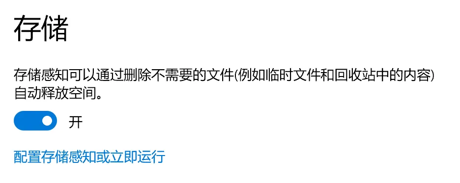

单击 `配置存储感知或立即运行` 进入下面的页面：


@tab Windows 11#win11

在设置中进入 **系统-存储-存储感知** 开启存储感知。

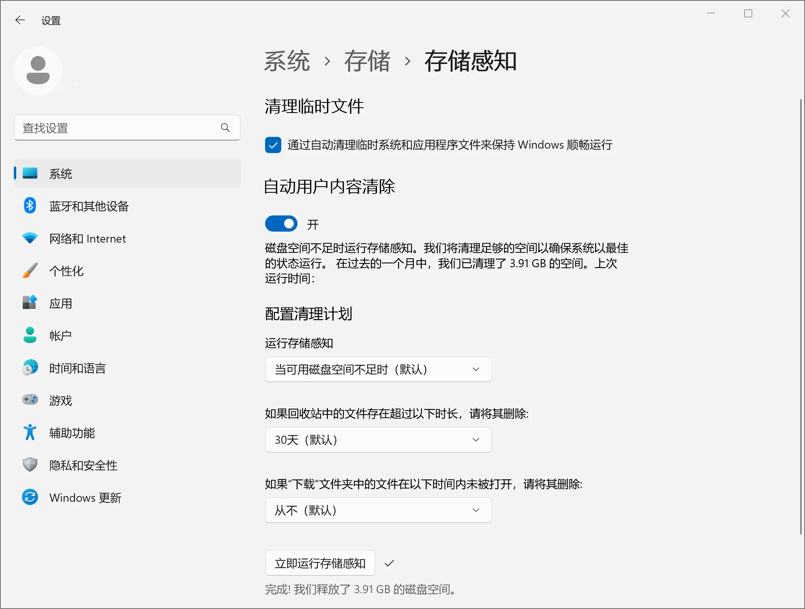

:::

### 调整分区或添置硬盘

一般来说，C 盘小于 100GiB 可能确实不太够，我们可以考虑使用分区工具调整其它分区的空间到 C 盘，不过这不是本文讨论的内容，请参考 [施工中](404)。

如果没有空余的空间可用于调整，可能要考虑买硬盘（电脑有空的硬盘位） / 换硬盘（电脑没有空的硬盘位）了，针对具体的型号、容量等，大家可以在 QQ 频道和答疑群中参考他人的意见。

### 调整习惯

定期整理、清理文件，适当归类存放文件会很有帮助，如果大家还在犹豫什么时候开始，那就是现在 :D！
