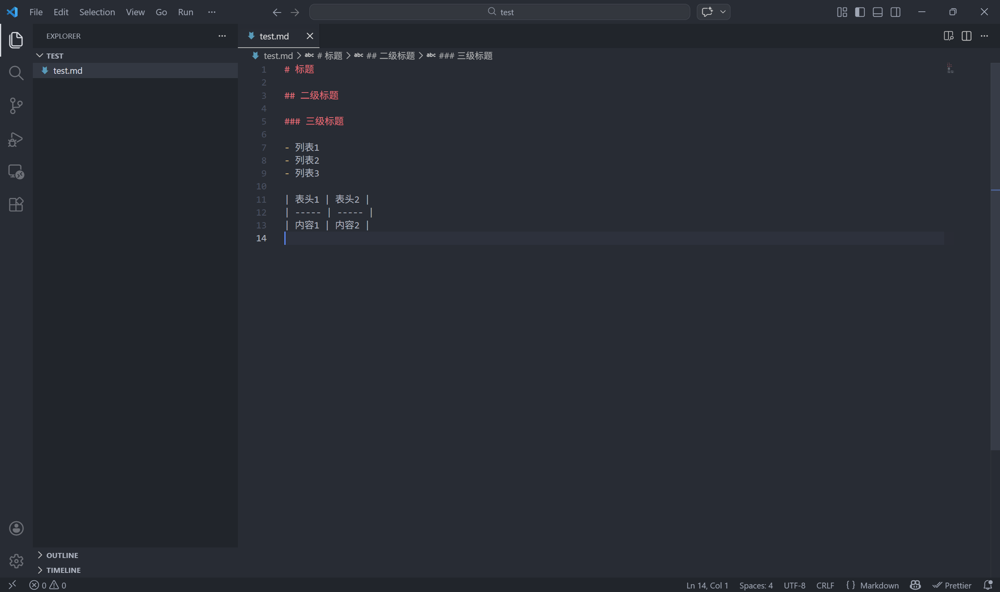
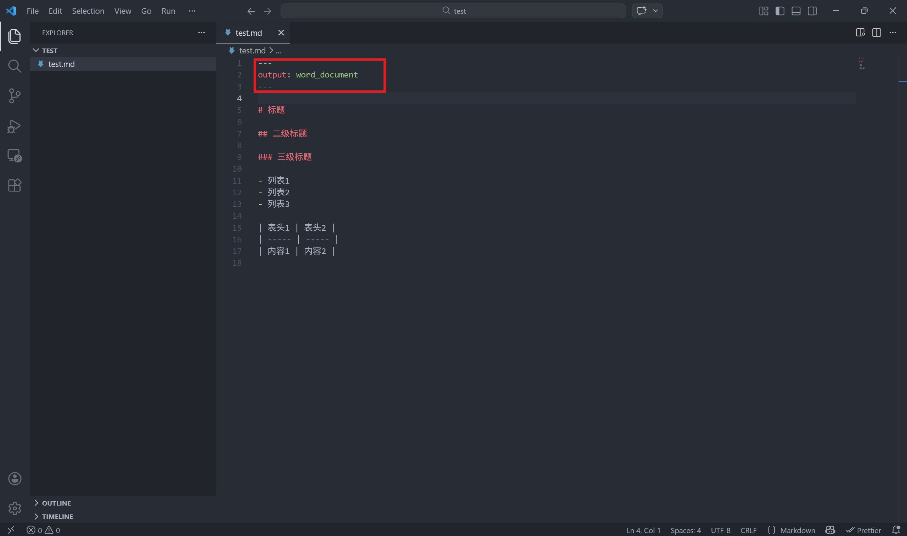
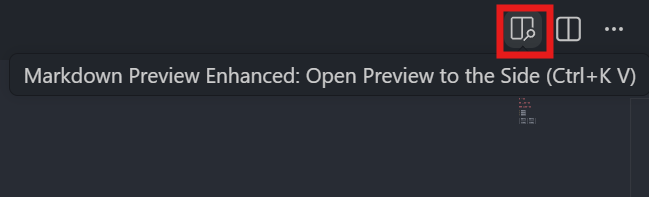
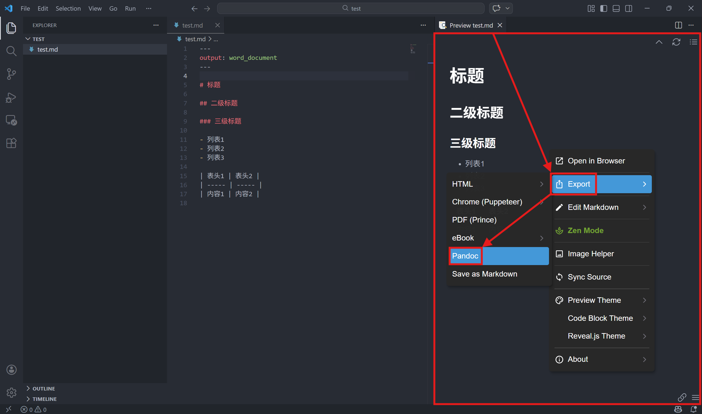
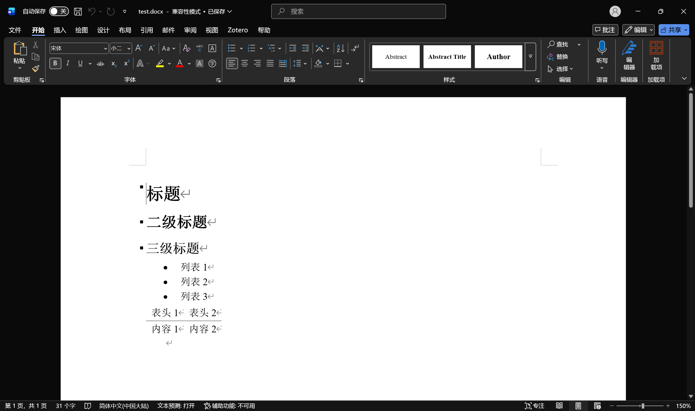
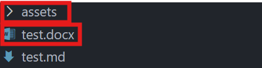
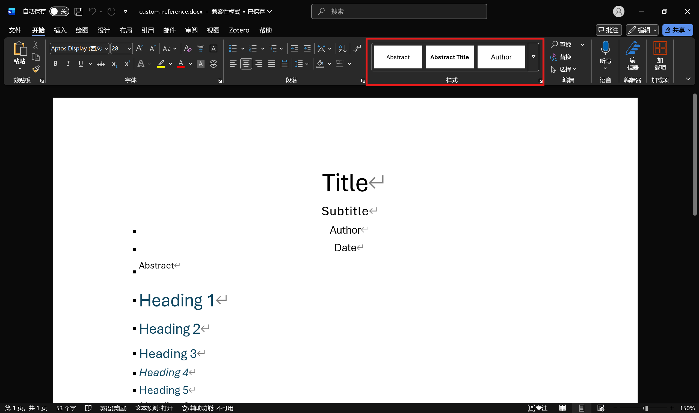

本文介绍了如何使用 `Pandoc` 将 `Markdown` 文档转换为 `Word` 文档。

<!-- more -->

## 环境准备

### 安装 Pandoc

Pandoc 官方提供了 [安装指引](https://pandoc.org/installing.html) ，可以根据自己的操作系统选择合适的安装方式。

具体而言，可以从 [Pandoc GitHub Releases](https://github.com/jgm/pandoc/releases) 页面最新版本的 `Assets` 栏下载与自己操作系统对应的安装包进行安装，具体对应关系如下：

| 操作系统               | 安装包名（截至2026-03-16最新版本为3.9）        |
| ---------------------- | ---------------------------------------------- |
| Windows                | pandoc-版本号-windows-x86_64.msi               |
| macOS（Apple Silicon） | pandoc-版本号-arm64-macOS.pkg                  |
| macOS（Intel）         | pandoc-版本号-x86_64-macOS.pkg                 |
| Linux（amd64）         | pandoc-版本号-linux-amd64.tar.gz（需编译安装） |
| Linux（arm64）         | pandoc-版本号-linux-arm64.tar.gz（需编译安装） |

另外，也可以通过包管理器安装，例如：

- Windows: `winget install --source winget --exact --id JohnMacFarlane.Pandoc`
- macOS：`brew install pandoc`
- Linux：`sudo apt install pandoc`（Debian/Ubuntu）、`sudo dnf install pandoc`（Fedora）等等

更多安装方法请见官方指引。

### 安装 VS Code 和 Markdown Preview Enhanced 插件（以下简称为 `MPE`）

这部分非必需，但 VS Code 可以作为一个好用的 `Markdown` 编辑工具，而其社区提供的 MPE 插件提供了图形化的一键转换功能，使用起来比较方便。

在 [VS Code 官网](https://code.visualstudio.com/) 下载安装 VS Code。

在 VS Code 中打开扩展（Extensions）栏，搜索并安装 `Markdown Preview Enhanced` 插件。（如有需要可以顺便安装汉化插件，搜索 `Chinese`即可）

## 使用 Pandoc 转换 Markdown 为 Word

### 使用 MPE

在 VS Code 中打开一个 Markdown 文件。

::: tip
如果你不知道什么是 `Markdown` 也没关系，几乎所有大语言模型生成的文本都是 `Markdown` 格式的，你可以直接在 VS Code 中新建一个 `.md` 文件，将 AI 生成的文本复制粘贴进去，然后按照下面的步骤操作。
:::



在文档开头添加以下 `YAML Front Matter`，指定 `Pandoc` 输出格式为 `Word` 文档：

```Markdown
---
output: word_document
---
```



点击右上角 `Markdown Preview Enhanced: Open Preview to the Side` 打开预览窗口。



在右半边预览窗口右键，选择 `Export` ，在子菜单选择 `Pandoc`。



此时会弹出转换后的 Word 文档。



同时创建了 `assets` 空文件夹（ `MPE` 插件干的，没有影响）和与原 `Markdown` 文件同名的 `Word` 文档。



### 使用 Pandoc CLI

在终端中使用 `Pandoc` 命令行工具进行转换，命令格式如下：

```bash
pandoc input.md -o output.docx
```

其中 `input.md` 是你的 `Markdown` 文件名， `output.docx` 是你想要生成的 `Word` 文件名。

`Pandoc` 会自动识别目标文件的格式（根据文件扩展名），因此不需要在 `YAML Front Matter` 中额外指定输出格式。

需要注意的是，`Pandoc` 支持许多拓展语法，例如 [参考文献](https://pandoc.org/demo/example33/9.1-specifying-bibliographic-data.html) 等，如果你的 `Markdown` 文档中使用了有关语法，有时 `MPE` 插件默认启用了，但你需要额外指定参数以启用它们，例如：

```bash
pandoc input.md -o output.docx --citeproc
```

更多信息请参考官方 [使用手册](https://pandoc.org/MANUAL.html) ，建议善用浏览器页面搜索功能。

## 为 Word 文档添加样式模板

### 创建模板

首先使用 `Pandoc CLI` 创建模板文件：

```bash
pandoc -o custom-reference.docx --print-default-data-file reference.docx
```

打开 `custom-reference.docx`。



修改样式并保存。

::: warning
如果直接修改该模板文件的内容文本的格式或者新增样式而非修改原有样式，将不会被 `Pandoc` 识别，导致输出的 `Word` 文档样式不生效。
:::

### 应用模板

#### 作为参数使用

在 `Pandoc` 命令行中使用 `--reference-doc` 参数指定模板文件路径：

```bash
pandoc input.md -o output.docx --reference-doc=path/to/custom-reference.docx
```

其中 `path/to/custom-reference.docx` 是刚刚创建的模板文件的路径。

然而这种方法配合 `MPE` 插件使用需要额外配置，下面将模板文件设置为默认，可以省去一些麻烦。

#### 设置为默认模板

`Pandoc` 默认会在以下路径寻找模板文件：

- Linux/macOS：`$HOME/.local/share/pandoc/`
- Windows: `%APPDATA%\pandoc\`

其中 `$HOME` 是用户主目录， `%APPDATA%` 是 Windows 的应用数据目录（通常位于 `C:\Users\用户名\AppData\Roaming`），你可以尝试直接将系统对应的路径的上级目录（去掉 `pandoc/` ）输入到文件管理器，一般能跳转到正确位置，如果在那里没有看到 `pandoc/` 文件夹，需要手动创建。

将 `custom-reference.docx` 文件复制到系统对应的上述路径下，并改名为默认模板名 `reference.docx`，即可将其设置为默认模板文件。

这样在使用 `MPE` 插件或不加有关参数的命令导出 `Word` 文档时，就会自动使用该模板，无需额外配置。

另外可以通过 `--data-dir` 参数指定自定义路径，在其下放置 `reference.docx` ：

```bash
pandoc input.md -o output.docx --data-dir=path/to/data/dir
```

详见 [官方文档](https://pandoc.org/MANUAL.html#option--data-dir) 。
