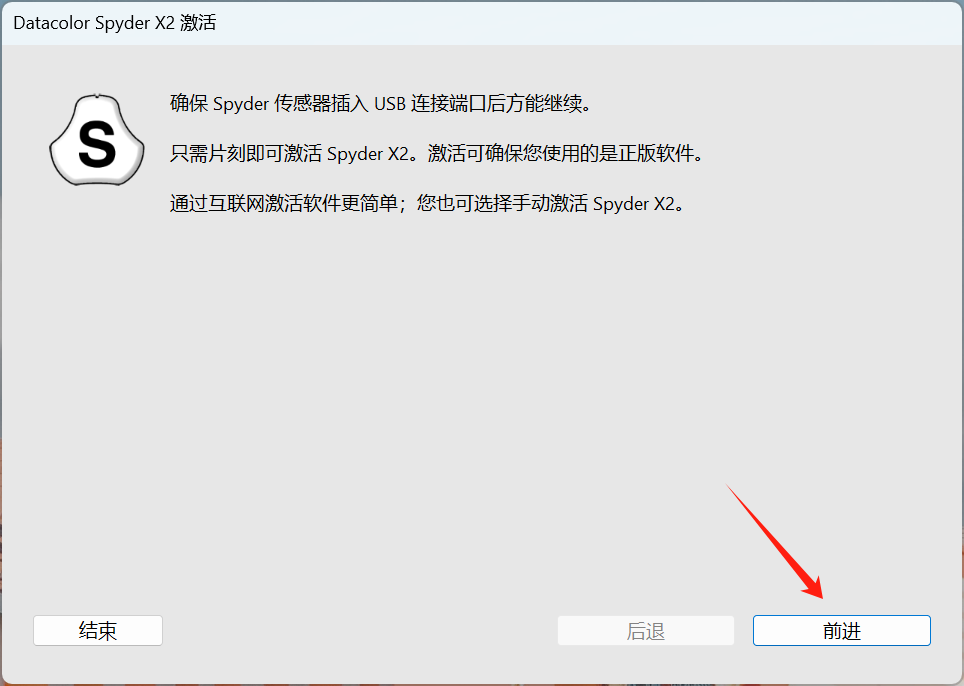
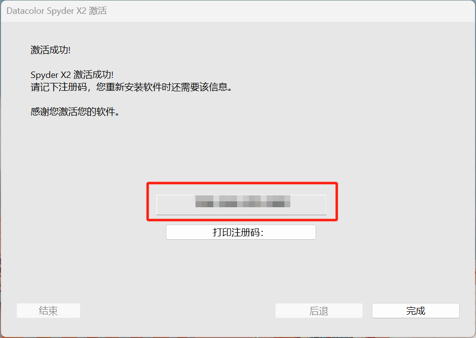
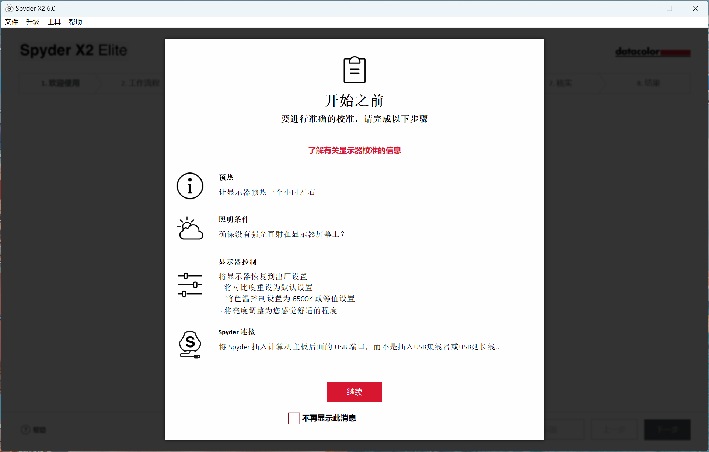
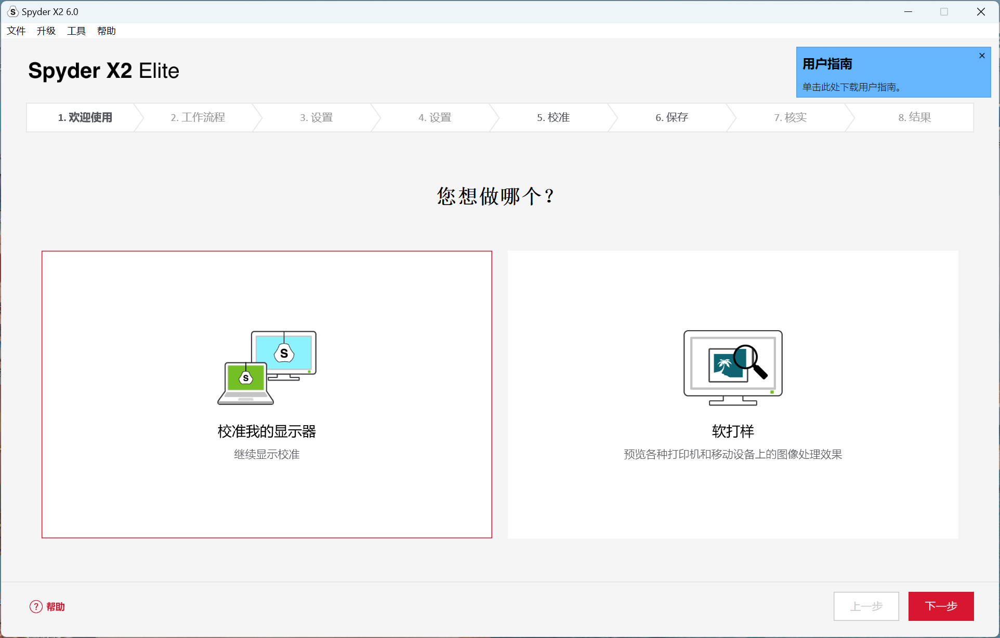
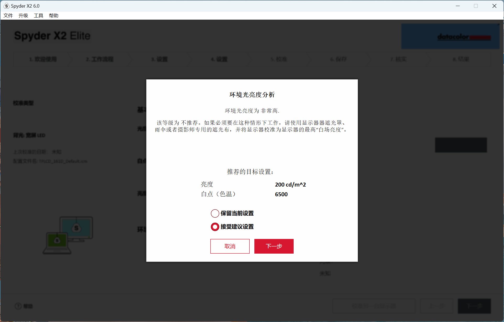
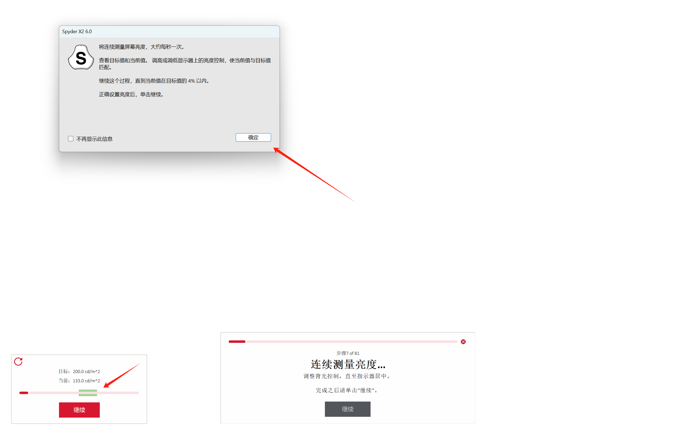

本文介绍了 Datacolor Spyder X2 Elite 校色仪配合 Spyder X2 6.0 软件的使用方式。

<!-- more -->

## 软件安装

官方下载链接：

[https://goto.datacolor.com/download/win/sxu200](https://goto.datacolor.com/download/win/sxu200)

快速下载链接：

[https://baijiaoxi-static.oss-cn-shanghai.aliyuncs.com/datacolormini/software/SpyderX2_6.0_Setup.exe](https://baijiaoxi-static.oss-cn-shanghai.aliyuncs.com/datacolormini/software/SpyderX2_6.0_Setup.exe)

## 软件使用

### 注册流程

初次使用 Spyder X2 时，要首先进行注册。

启动 Spyder X2 6.0。插入 Spyder X2 Elite 后，选择“前进”。

激活界面选择在线激活，输入包装盒底的注册码。输入姓名邮箱时可以随意输入。

激活成功后，保存出现的注册码。

### 校色过程

软件启动之后会出现提示界面，可以参考。（粗调的话没必要真预热一个小时就是了）

一路选择“校准我的显示器”，显示校准。

在显示设置中选择显示器，选择对应的显示器类型（桌面指一般的外接显示器），显示技术选择“宽屏LED”，识别控制方式选择“亮度”。

在校准设置中全部选择推荐，校准类型按需选择 FullCal（首次校准）和ReCal（再次校准）。

随后按提示将校色仪放置在桌面上，周围光照保持与工作环境类似的光照，进行亮度分析，选择接受建议配置，下一步。

之后按提示将校色仪挂在显示器上，开始校色。过程中会提示调整显示器亮度。首先点击提示框的确定，随后调整显示器亮度尽量落在绿色范围内。

出现测量完成后，先拔掉校色仪，再点击完成。

在保存界面中，修改配置文件名称，不能有中文，点击保存。选择提醒时间，点击下一步。

下一个界面中，可以通过右侧的切换选项查看校色效果。

下一个界面中，可以查看配置文件概览。之后可以点击结束退出。
