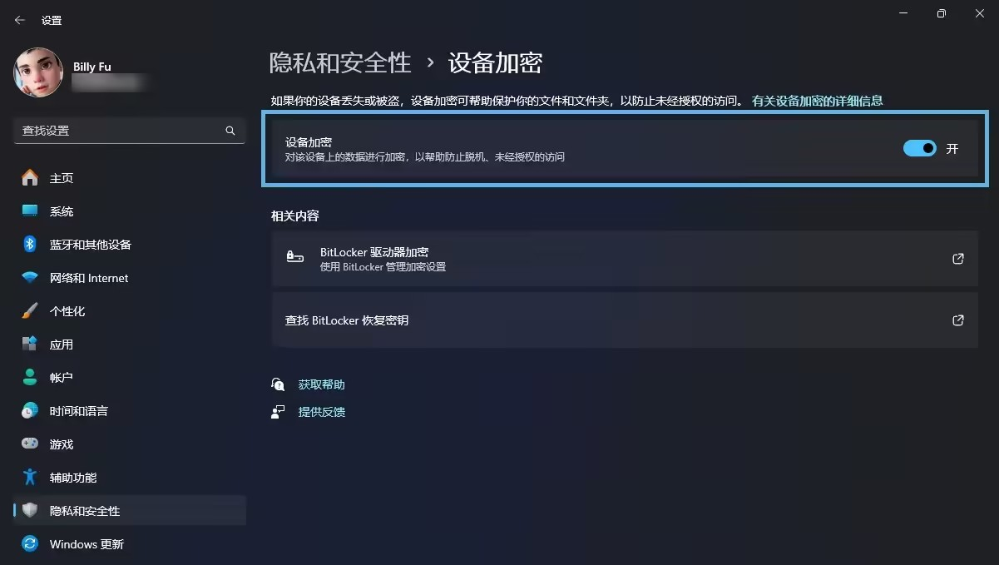

本文介绍了关闭 Bitlocker 的理由以及具体操作步骤。

<!-- more -->

在 Windows 系统中，BitLocker 是一项强大的磁盘加密功能，电脑预装的家庭版系统支持其中的一部分特性，并默认开启全盘加密。如图，图标上带锁就说明这个盘开启了 BitLocker。

但对普通用户来说，你可能反而需要关闭它，才能确保个人数据的 “安全”。且添加或移除内存、硬盘等硬件，或调整电脑C盘大小等操作之前，都要先关闭 BitLocker。下面以 Windows 11 家庭中文版 24H2 为例，详细介绍关闭 BitLocker 的必要性及具体操作步骤（Windows 10 /11其他版本大同小异）。

## 关闭 BitLocker 的必要性

1. **性能影响**：启用后，系统在读写磁盘数据时需要占用一定系统资源来加密、解密，导致电脑性能下降。在文件复制、系统启动等操作时，速度会更慢。
2. **兼容性问题**：部分老旧的软硬件设备可能不支持 BitLocker 加密的磁盘。当你需要使用这些设备或软件访问加密磁盘时，会遇到无法识别或访问受限的问题。例如一些较旧的外置硬盘盒，在连接到加密硬盘时，可能无法正常读取数据。
3. **忘记恢复密钥**：如果登录了微软账户且网络环境良好，密钥会保存到微软服务器上。但你可能使用了本地账户来登录，且事前没把密钥记在纸上，而某一天电脑 “心情不好”（如图。可能是你修改了软件或硬件，也可能真的就是随机发生），在开机时要求你输入密钥，那便只能和自己的数据说再见了。恢复密钥一旦丢失，可以认为不可能找回。

## 关闭 BitLocker 的具体步骤

1. **打开设置**：按 `Win+I` 组合键。或：通过在任务栏搜索框中输入 `设置`，然后点击搜索结果来打开。
2. **打开 `隐私和安全性`**：在左侧列表中选择 `隐私和安全性`。
3. **`设备加密` 页面**：在 `安全性` 区域，选择 `设备加密` 页面。
4. **关闭 `设备加密` 开关**：点击上图蓝框中的选项。系统会弹出一个确认对话框，提示你关闭设备加密后，该驱动器上的数据将不再受到加密保护。
5. **等待解密过程**：点击关闭后，系统将开始对驱动器进行解密操作。这个过程可能需要一些时间，具体取决于驱动器的大小和数据量。在解密过程中，电脑可以正常使用，但建议不要进行大量数据读写操作，以免影响解密速度。你可以在该窗口中查看解密进度。
6. **完成关闭**：当解密进度达到 100% 后，BitLocker 将成功关闭。此时，你的磁盘数据已不再处于加密状态。家庭版系统完成上述操作后，无法再访问「设备加密」页面，即不能再次打开 BitLocker。

通过以上步骤，你就可以顺利关闭 Windows 11 系统中的 BitLocker 加密功能了。
