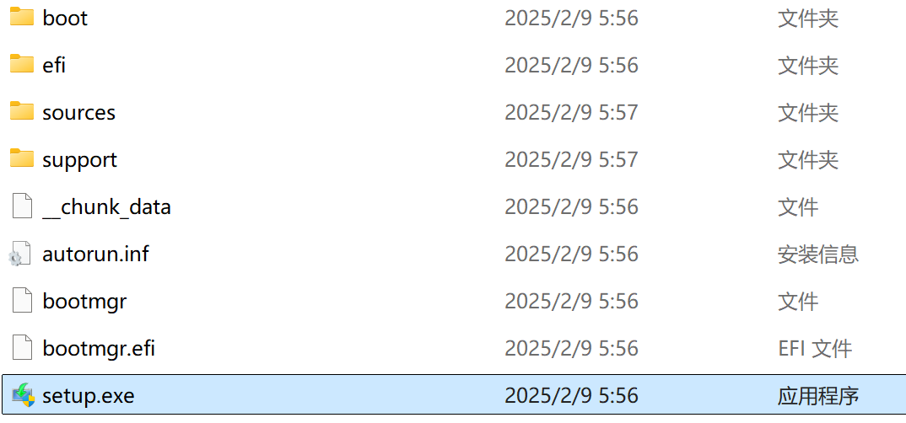
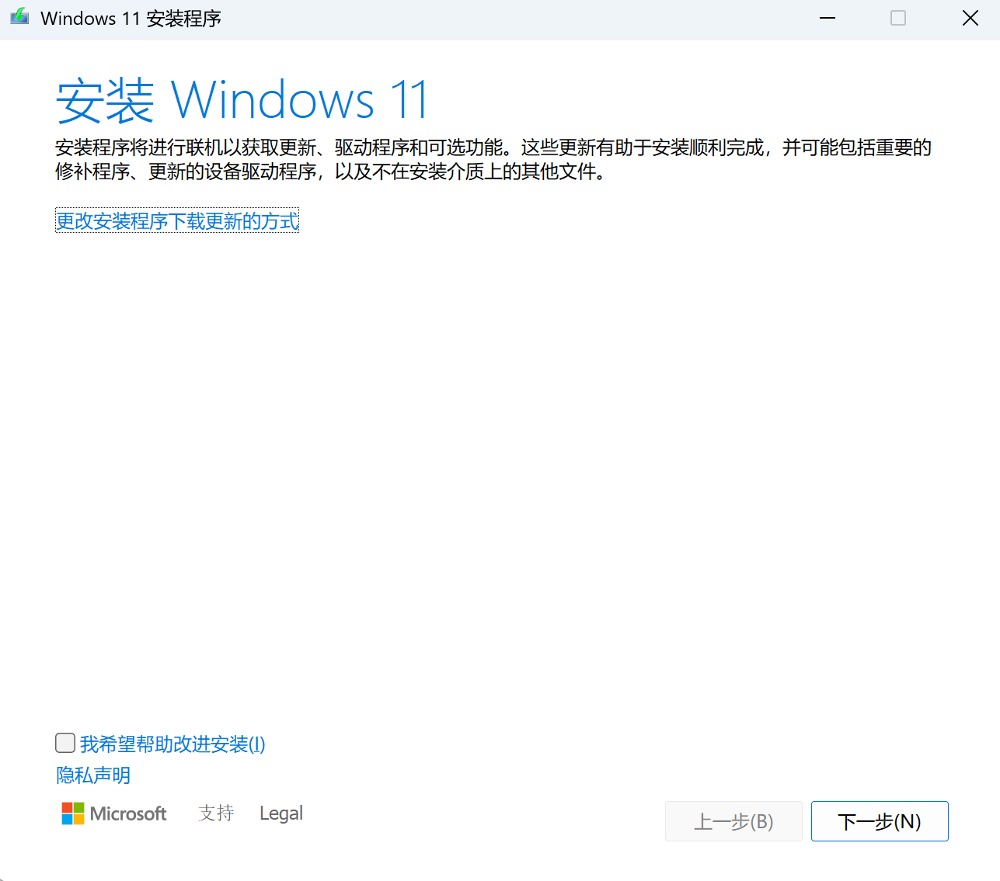
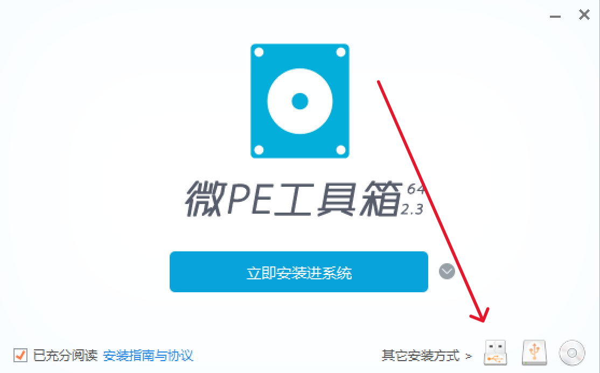
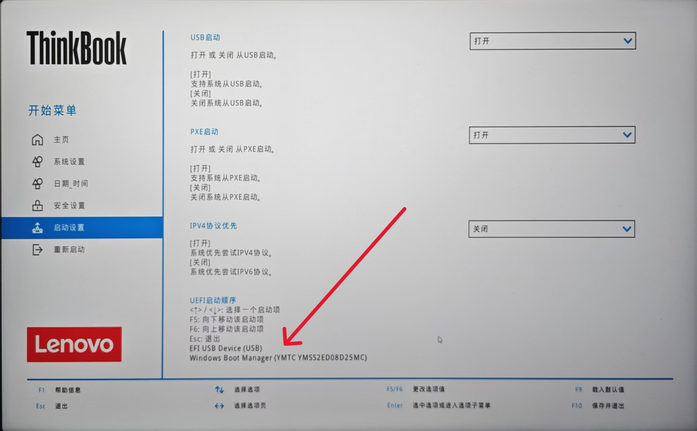
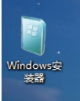

本文介绍了 Windows 安装/重新安装的基本方式。

<!-- more -->

## 解锁 Bitlocker

::: caution
除非有非常特殊的理由，不推荐任何人开启 Bitlocker。一般 Bitlocker 只会带来丢失全部数据的悲惨结局。
:::

目前新款笔记本电脑在出厂时，系统便默认开启了 Bitlocker 加密功能。在重装系统过程中，系统配置可能会发生变化，这些变化会被 BitLocker 检测到，并认为系统可能受到威胁，因此自动触发加密保护，以防止未经授权的访问。

为了避免重装 Windows 后因 Bitlocker 加密导致数据丢失，因此，在重装系统前请确认解锁 Bitlocker。

解锁操作详见[关闭 Bitlocker](unlock-bitlocker.md)。

## 数据备份

::: warning
电脑有价，数据无价！重装系统前请一定要备份好数据！！！
:::

虽然目前**大多数**安装镜像在系统重装后会生成 `windows.old` 文件夹**_​（所有的镜像重装系统都会重置C盘数据，请注意！）_**，但仍有个别!!抽风的!!老旧的安装镜像会将电脑数据全部格式化。因此在重装系统时请一定备份好数据。

目前推荐使用云备份、U盘备份或移动硬盘备份等，请注意备份完毕后将U盘或移动硬盘拔出！!!笔者就曾因忘记拔出移动硬盘导致数据被一锅端!!

## 系统镜像下载

**如果你的电脑已经不能进入系统，请寻找一台正常的电脑进行下述步骤。**

有以下几种常见下载方式：微软官网下载，CSDN 下载，UUP dump 下载。这里只介绍官网下载方式。

打开微软[官方下载地址](https://www.microsoft.com/zh-cn/software-download/windows11)，下滑到下方 `下载适用于 x64 设备的 Windows 11 磁盘映像 (ISO)`，在 `选择"下载"` 下拉框中选择 `Windows 11 家庭版（仅限中国）`，点击 `立即下载`，在新出现的 `选择产品语言` 的 `选择一个选项` 中选择 `简体中文`，点击 `确认`，在新出现的 `下载 - Windows 11 Home China 简体中文` 中点击 `64-bit Download`，即开始下载镜像文件。

## 系统安装

这里介绍通过 `setup.exe` 进行安装以及通过 PE 进行安装。

::: warning 重要
安装系统前请检查您的电脑是否满足安装该系统的最低要求，否则可能会导致安装失败

[请点击这里检查你的电脑是否满足安装 Windows 11 的最低要求](https://aka.ms/SetupWindowsSpecifications)

安装前请查看 [Windows 版本信息状态](https://aka.ms/windowsreleasehealth)，了解可能影响你设备的已知问题。
:::

### `setup.exe` 安装

对于能进入系统的电脑，可以直接用 `setup.exe` 进行安装。如果电脑已经无法启动，请参考 [PE 安装](#pe-安装)。

双击下载好的文件，等其自动加载后双击 `setup.exe` 文件。

保持默认并接受使用条款即可。

无脑下一步。

**请跟随安装程序的指示操作。**

推荐在此时选择 `下载更新、驱动程序和可选功能`。

此时你的电脑会自动重启几次，这是正常现象，请不要惊慌。

### PE 安装

PE 安装主要针对无法进入系统的电脑，当然能进系统的电脑也可以用 PE 安装。

下载[微 PE 工具箱](https://www.wepe.com.cn/download.html)，一般用比较新的那版。

**选择相应版本下载即可，可以不捐赠。**

双击打开下载文件，选择 `安装PE到U盘`（箭头所指处）

`待写入U盘` 处选择你准备的U盘，其余部分与图片保持一致或推荐即可。点击 `立即安装PE到U盘`。

等待程序自动运行完毕后拔出U盘，插入你想重装系统的电脑中。

更改电脑启动顺序，将该U盘设置为第一启动项。

::: tip
如果电脑拦截U盘启动，请关闭bios中`安全启动`选项。
:::

**具体如何更改因电脑品牌与型号不同而异，请自行根据电脑型号搜索，下图仅为举例。**

进入 PE 系统界面，点击 `Windows 安装器`。

`选择安装映像文件位置` 选择刚刚下载的 iso 文件。

`选择可引导驱动器位置` 选择原系统盘位置。

在 `选项` 处选择要安装的版本，_建议家庭版_。

安装确定即可。

等待进度条加载完毕

此时你的电脑会自动重启几次，这是正常现象，请不要惊慌。

## 关于系统激活

一般来说，笔电的厂商会随笔记本附送 Windows 家庭版的激活，在重装系统后系统会自动激活。如果你的笔记本未附送激活码或者你安装的是其它版本的 Windows，请自行解决激活问题。

## 驱动程序的安装

如果你在安装系统时选择 `下载更新、驱动程序和可选功能`，一般会安装绝大部分驱动。也可在设置中找到 `Windows 更新`，检查更新即可。

如果没有正确安装某些驱动，可以去电脑硬件官网下载。

你可能希望显卡驱动新一些，以下是主要显卡品牌的驱动程序下载地址：

[NVIDIA 显卡](https://www.nvidia.cn/drivers/lookup/)

[AMD 显卡](https://www.amd.com/zh-cn/support/download/drivers.html)

[Intel 显卡](https://www.intel.cn/content/www/cn/zh/download-center/home.html)
