适用于 Linux 的 Windows 子系统 (WSL) 可让开发人员直接在 Windows 上按原样运行 GNU/Linux 环境（包括大多数命令行工具、实用工具和应用程序），且不会产生传统虚拟机或双启动设置开销。

<!-- more -->

## 简介

WSL 旨在为希望同时使用 Windows 和 Linux 的开发人员提供无缝高效的体验，其支持相当多的Linux发行版如 Ubuntu、Debian、Kali 等。且完全支持 Linux 常见的命令行工具，如 `bash`、`grep`、`sed`、`awk`。其还可以使用类似于 Unix 的命令行 shell 调用 Windows 应用程序。同时可以直接在 Windows 上运行 Linux 的图形应用程序，同时可以使用你电脑上的 GPU 进行机器学习相关的应用（效率高于 Windows）

## 安装

本教程以 Ubuntu 22.04 版本的 WSL 2 安装为示例进行安装。

### WSL 2

WSL 2 使用虚拟化技术在轻量级实用工具虚拟机 (VM) 中运行 Linux 内核。 Linux 发行版作为独立的容器在 WSL 2 托管 VM 内运行。 通过 WSL 2 运行的 Linux 发行版将共享同一网络命名空间、设备树（而非 `/dev/pts`）、CPU/内核/内存/交换空间、`/init` 二进制文件，但有自己的 PID 命名空间、装载命名空间、用户命名空间、`Cgroup`命名空间和 `init` 进程。如果你需要查看 WSL 1 和 WSL 2 的区别，请参考[比较 WSL 版本](https://learn.microsoft.com/zh-cn/windows/wsl/compare-versions)。

对于绝大多数情况下的应用，你都应该选择 WSL 2 而不是 WSL 1，并且微软目前已经停止更新 WSL 1，其可能在之后取消支持。除非有特殊强调，本教程之后使用的 WSL 一词均为 WSL 2。

### 前置条件

要想在 Windows 系统中使用 WSL，你的 Windows 系统本身需要满足一些版本要求，如下表。

| 版本                                              | 是否支持 WSL(Y/N) |
| ------------------------------------------------- | ----------------- |
| Windows 95、98、XP、Vista、7、8、8.1              | N                 |
| Windows 10（2004版本以下/内部版本 19041以及更低） | N                 |
| Windows 10（2004版本以上/内部版本 19041以及更高） | Y                 |
| Windows 11                                        | Y                 |

#### 如何知道我的 Windows 版本

键入 `Win+R` 快捷键。

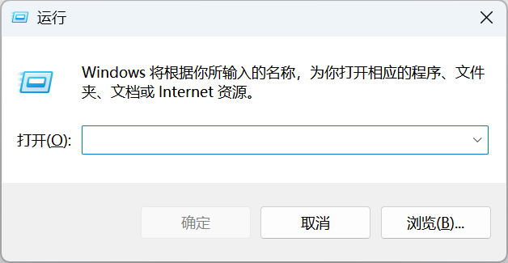

输入 `winver`

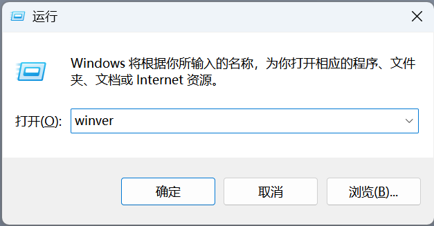

回车后可以看到如下界面。

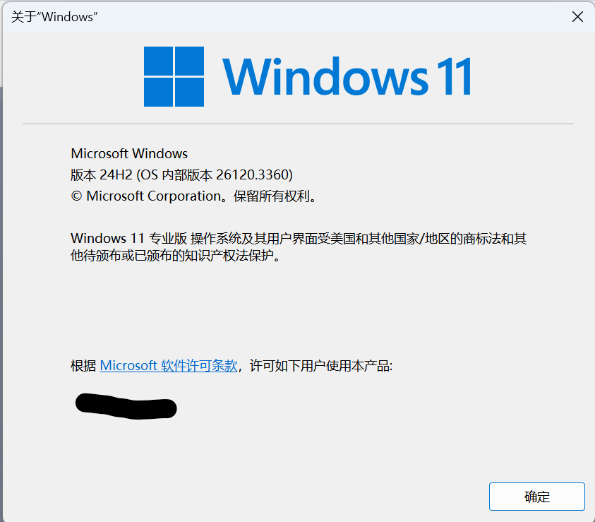

### 启用相关功能

键入 `Win+R` 快捷键。


键入 `control`

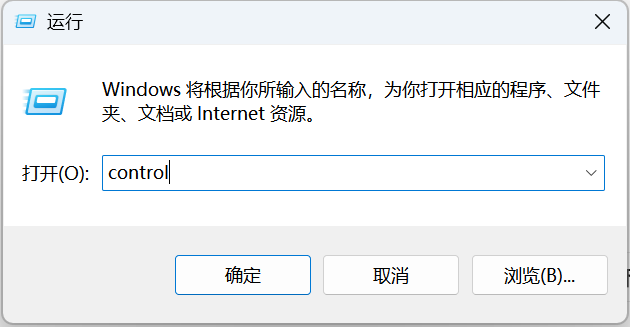

来到控制面板

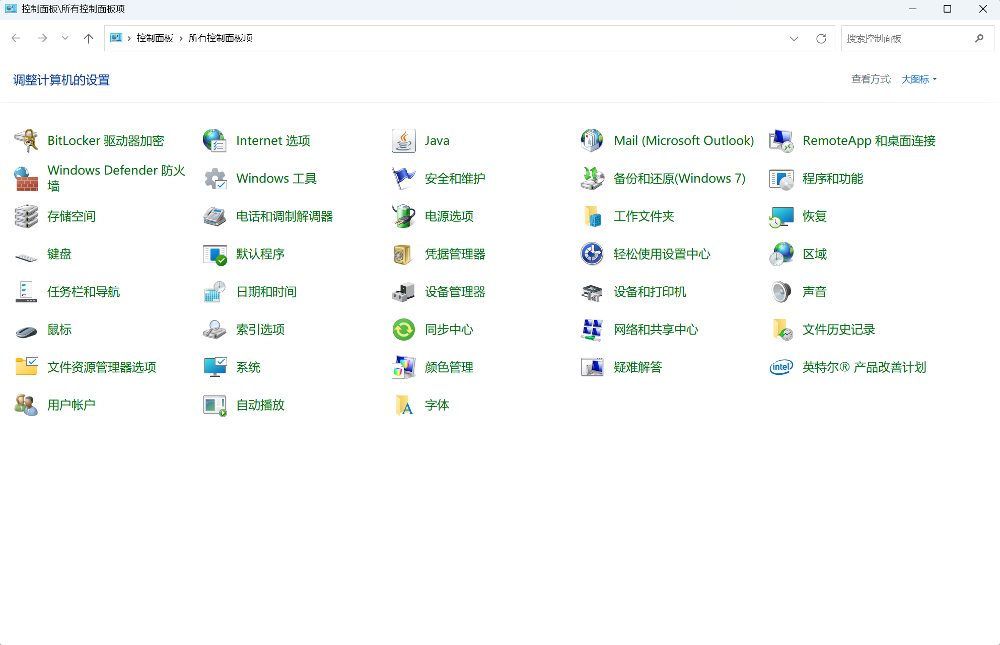

找到 `程序和功能` 可以看到左侧有一个 `启用或关闭 Windows 功能`


勾选如图所示的两个选项后点击确定

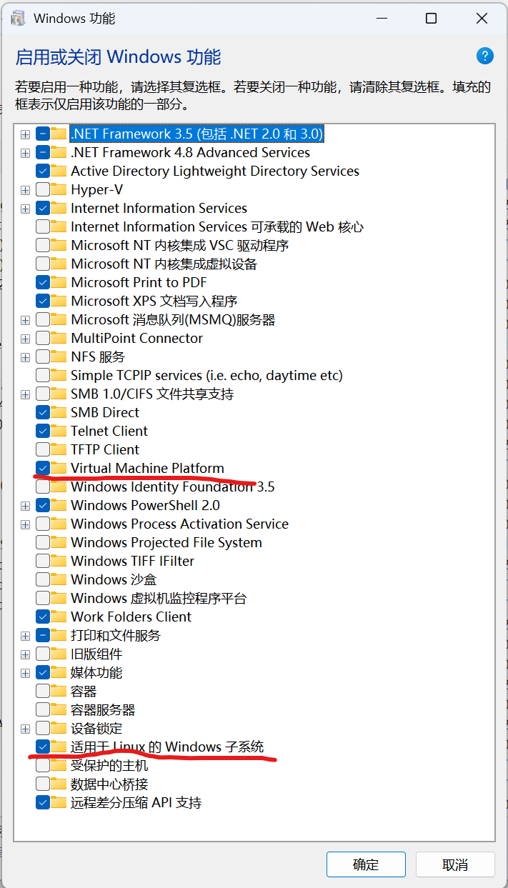

重启电脑

### 更新并配置 WSL

打开终端，输入 `wsl.exe --update` 如果显示找不到 `wsl.exe` 请重复上一步骤。

**此步骤可能需要管理员权限。**


在更新完成后，输入 `wsl --set-default-version 2`

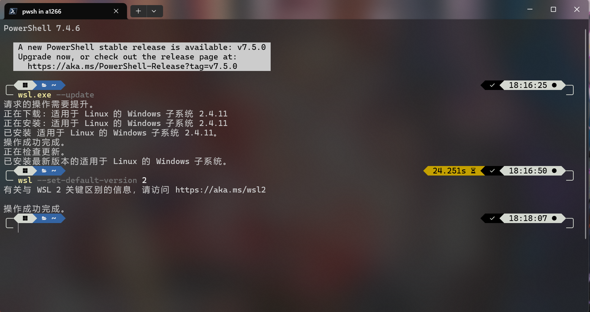

### 下载 Linux 发行版

打开微软商店，直接搜索 `ubuntu`。

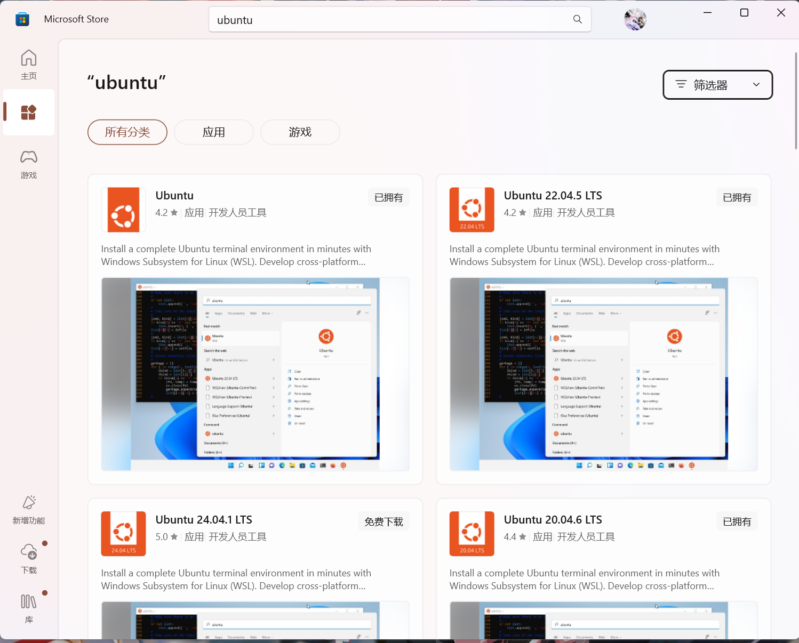

选择一个合适的版本点击下载，请注意没有带版本号的为最新版。本教程选择 Ubuntu 22.04.5 LTS。

如果你要其他发行版，微软商店提供了部分发行版的安装，如果你要求特殊（如 ArchLinux）可以去 GitHub 寻找[方案](https://github.com/yuk7/ArchWSL)。

### 安装 Ubuntu

打开刚刚安装的 Ubuntu，会进入安装界面，需要你设置用户名和密码。

这里建议用户名和密码都使用英文，无其他要求。


然后即可成功进入终端。


WSL 与其他的虚拟机不一样的地方在于其没有桌面系统，基本上通过终端控制，但再开启 WSLg 后，使用 WSL 内的带 gui 的软件可以启动 gui（依旧没有桌面）。

## 配置 WSL

首先，强烈建议在 Windows 上使用 `Windows Terminal` 进行多终端的管理和切换，该应用在 Windows 11 无需安装，在 Windows 10 需要[手动安装](https://github.com/microsoft/terminal)。

在 Windows Terminal 下，我们可以打开多个终端，我们新安装的 Ubuntu 也会在这里出现，点击即会打开 WSL。


### 软件源更换

新安装的 Ubuntu 其软件源默认为国外网址，在某些网络情况下可能会网络速度奇慢，故我们可以将软件源更换为国内镜像源。

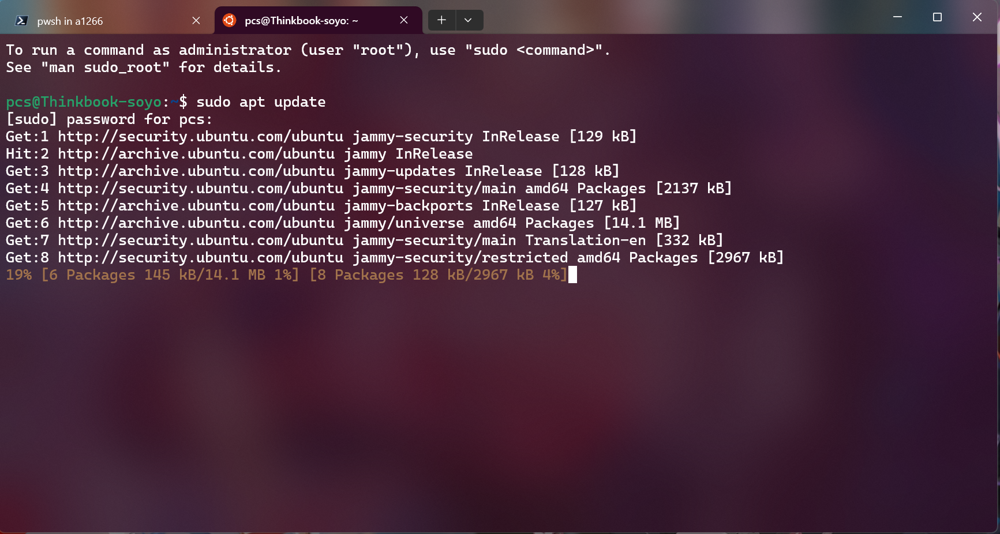

这里推荐清华源，其官方网址为：[https://mirrors.tuna.tsinghua.edu.cn/](https://mirrors.tuna.tsinghua.edu.cn/)，其官网拥有换源的[详细教程](https://mirrors.tuna.tsinghua.edu.cn/help/ubuntu/)。

在终端，输入 `sudo vim /etc/apt/sources.list`


注释掉原有的源，即加一个 `#` 号

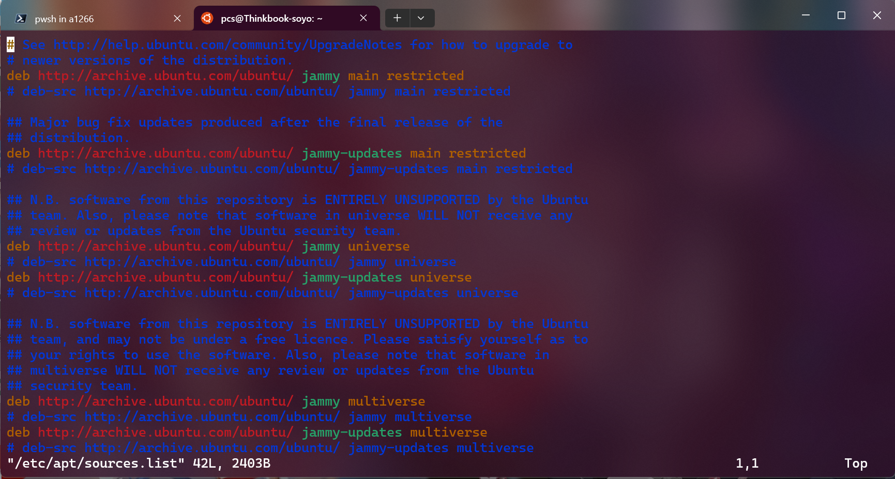

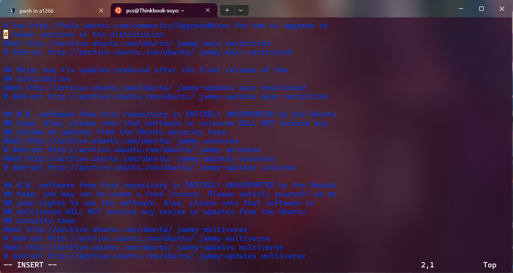

插入清华源的网址

```text
# 默认注释了源码镜像以提高 apt update 速度，如有需要可自行取消注释
deb https://mirrors.tuna.tsinghua.edu.cn/ubuntu/ jammy main restricted universe multiverse
# deb-src https://mirrors.tuna.tsinghua.edu.cn/ubuntu/ jammy main restricted universe multiverse
deb https://mirrors.tuna.tsinghua.edu.cn/ubuntu/ jammy-updates main restricted universe multiverse
# deb-src https://mirrors.tuna.tsinghua.edu.cn/ubuntu/ jammy-updates main restricted universe multiverse
deb https://mirrors.tuna.tsinghua.edu.cn/ubuntu/ jammy-backports main restricted universe multiverse
# deb-src https://mirrors.tuna.tsinghua.edu.cn/ubuntu/ jammy-backports main restricted universe multiverse

# 以下安全更新软件源包含了官方源与镜像站配置，如有需要可自行修改注释切换
deb http://security.ubuntu.com/ubuntu/ jammy-security main restricted universe multiverse
# deb-src http://security.ubuntu.com/ubuntu/ jammy-security main restricted universe multiverse

# 预发布软件源，不建议启用
# deb https://mirrors.tuna.tsinghua.edu.cn/ubuntu/ jammy-proposed main restricted universe multiverse
# # deb-src https://mirrors.tuna.tsinghua.edu.cn/ubuntu/ jammy-proposed main restricted universe multiverse
```


保存该文件（如果不会 vim 可以尝试使用 nano）

键入 `sudo apt update` 即可使用新的软件源

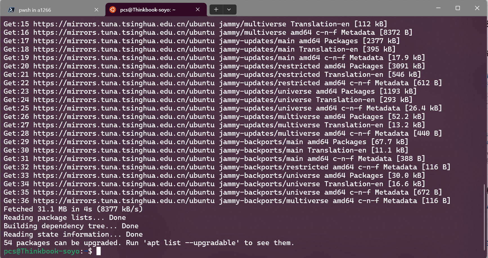

### 设置更改

对于较新版本的 WSL，在你安装后在开始菜单中会有一个 `WSL Settings`。


里面可以进行一些虚拟机常见的设置。


这里主要讲述一下网络设置。

如果你需要在 WSL 中部署一些服务并通过网络暴露端口，在 WSL 默认设置下其为 NAT 模式，同时 Windows 和 Linux 间还有防火墙，我们可以将其改为 Mirrored 模式，使得 WSL 的网络和宿主机一致，同时可以指定专门的端口给 Windows 进行使用（请指定高位端口）。


## WSL 移动

WSL 默认会在 `C` 盘存放其 vmx 文件，并且会占用极大的空间，很容易塞满 `C` 盘，这里提供一种移动的方法。

在终端中输入 `wsl -l -v`


如果其不为停止状态，请关闭正在运行的 WSL。如 `wsl -t Ubuntu-22.04`

接下来输入 `wsl --export <name> <Path>` 在本例中为 `wsl --export Ubuntu-22.04 "E:\wsl\ubuntu-ex.tar"`


然后删除掉原先版本 `wsl --unregister <name>` 在本例中为 `wsl --unregister Ubuntu-22.04`


重新导入 WSL，输入 `wsl --import <Distribution Name> <InstallLocation> <FileName>` 在本例中为 `wsl --import Ubuntu-22.04 "E:\\wsl" "E:\\wsl\\ubuntu-ex.tar"`


默认的 Ubuntu 登录路径会变为 root，这里进行更改 `ubuntu2204.exe config --default-user pcs` 在本例中用户名为 pcs。

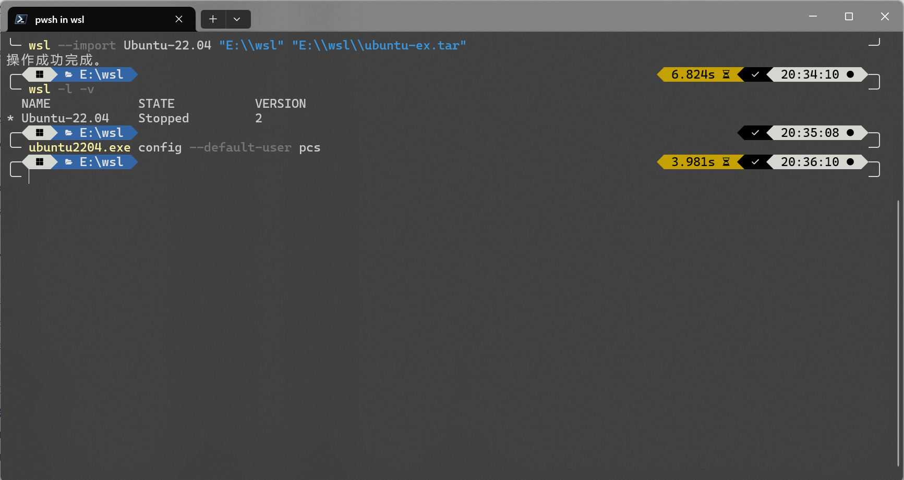

至此便完成了 WSL 的移动。
